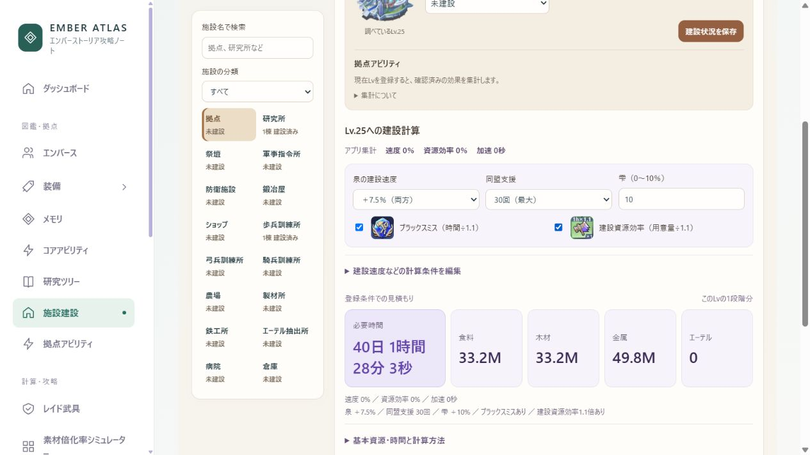
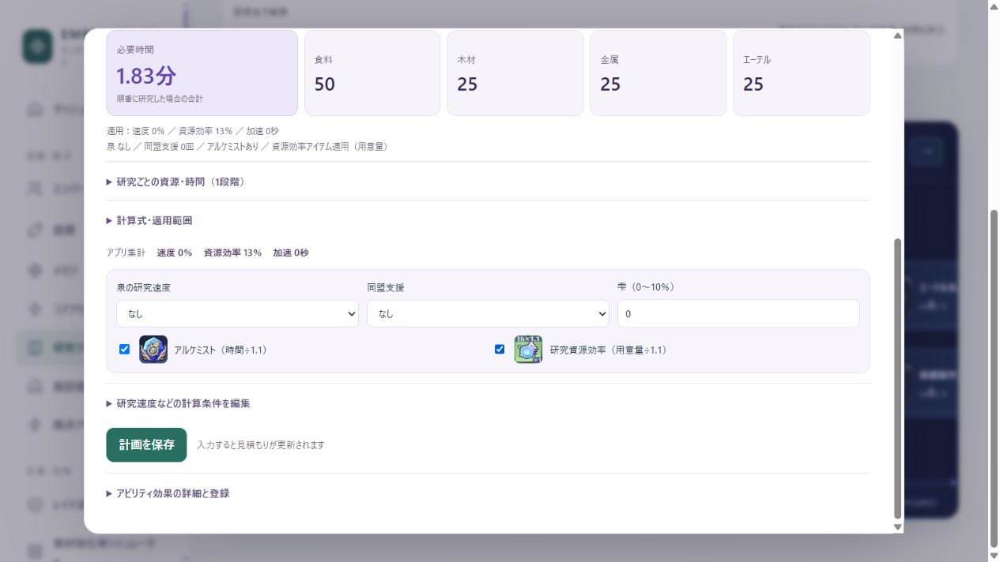

# 建設・研究アイコン・採集の雫 更新記録

## データ照合

PC版ローカルマスター Building / Ability / FieldArtifact / Consumable を参照。原本ハッシュと抽出値は game-building-effects-audit.json に記録。23施設定義（旧祭壇・属性別祭壇を含む）の41効果曲線を共通データへ反映。パワーは拠点アビリティ集計から除外。部隊スロット、同盟支援要請数、防衛・援軍収容数、訓練所収容数、病院収容数、資源保護などを補完。旧共通値の拠点由来「最大部隊兵士数」は Building に対応効果がないため置換し、最大防衛部隊兵士数を正しく反映。現在Lv・個人の所持記録は変更しない。

採集の雫は27設定を確認。全資源＋3/6/9%、各資源＋4/6/8/10/12/14%。採集速度へ加算する式へ修正。保存編成の14%も受理する。

## 実装・確認

- 研究：アルケミスト・研究資源効率にゲーム画像を配置。画像読み込みと選択を確認。画像は既存の提供ゲーム画面から切り出された assets/research のものを使用。
- 建設：研究と共通の配置で泉・支援・雫・ブラックスミス・資源効率を選択。自動集計・手入力対応。1段階の補正後資源と時間、基本値と式を表示。
- 拠点Lv25、泉7.5%、雫10%、支援30回、ブラックスミス、資源効率1.1倍：40日1時間28分3秒、食料33.2Mの表示を確認。
- 病院Lv31の登録で最大病院収容兵士数285,000を確認。
- 採集の雫14%で速度内訳14%、食料Lv6の基準12時間が10時間31分35秒となることを確認。資源量は変化しない。
- 390px幅で横はみ出しなし。ブラウザーエラーなし。
- 自動テスト158件成功（建設の計算順序、支援の下限、未知値、範囲検証、施設曲線、雫14%と保存検証を含む）。

検証は合成データの127.0.0.1:5175で実施。localhost:5174の個人データは未変更。泉・ブラックスミス・資源効率の計算順序は研究の既存見積もり方式に合わせており、ゲーム内部の端数処理は未確定。

